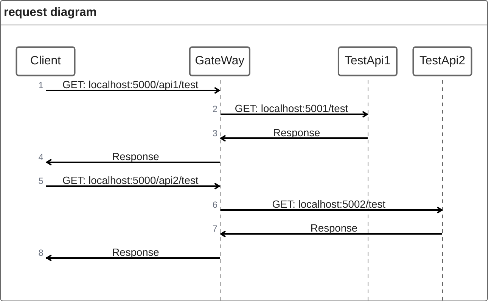

## Api services with yarp gateway

This project was created as part of learning how to customize the api gateway of a project based on the yarp library. 

```mermaid
zenuml
    title request diagram
    Client->GateWay: GET: localhost:5000/api1/test
    GateWay->TestApi1: GET: localhost:5001/test
    TestApi1->GateWay: Response
    GateWay->Client: Response
    
    
    Client->GateWay: GET: localhost:5000/api2/test
    GateWay->TestApi2: GET: localhost:5002/test
    TestApi2->GateWay: Response
    GateWay->Client: Response
```